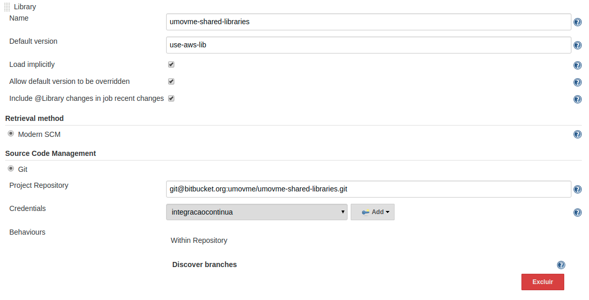
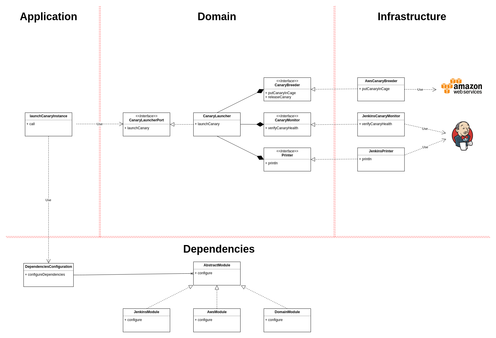

# Umov.me Shared Libraries

> Funções encapsuladas para tornar os Jenkins Pipelines mais simples


## Documentação
A documentação com as funções disponíveis pode ser [encontrada aqui](https://github.com/umovmecc/umovme-shared-libraries/wiki).


## Objetivo
O objetivo deste projeto é fornecer funções úteis e genéricas para serem utilizadas com a funcionalidade de [Shared Libraries](https://jenkins.io/doc/book/pipeline/shared-libraries/) do Jenkins Pipeline. Geralmente estas funções são comuns à muitos pipelines o que causaria replicação de código. Com este agrupamento de funções é possível eliminar as duplicações, deixando os arquivos de pipelines mais simples e limpos.

## Como utilizar
Para iniciar, é necessário importar as funções deste projeto no Jenkins. Para fazer isso, vá em *Manage Jenkins » Configure System » Global Pipeline Libraries* e preencha as seguintes informações.



Na opção *Default version* escolha a versão que você deseja utilizar. Este projeto possui tags seguindo o padrão [SEMVER](http://semver.org/), você pode usá-las para especificar versões. Para utilizar sempre a última versão disponível, preencha o campo com *master* e a branch *master* será utilizada.

Se você quiser, não é necessário marcar a opção *Load implicitly*. Caso você não utilize esta opção, será necessário importar manualmente este script utilizando a seguinte instrução no topo do Jenkinsfile.

```
@Library('jenkins-shared-libraries') _
```

Se você quiser utilizar outra versão, que não seja a configurada, você pode fazer isso informando-a no import.

```
@Library('jenkins-shared-libraries@1.0.0') _
```

Mais detalhes podem ser encontrados [aqui](https://jenkins.io/doc/book/pipeline/shared-libraries/#using-libraries).

Eventuais exemplos neste documento assumem que esta opção foi marcada, portanto imports são omitidos.

## Desenvolvimento
O projeto é desenvolvido em Groovy, utilizando como alvo Java 11.

### Arquitetura do projeto

Este projeto busca seguir a Arquitetura Hexagonal. Como pode ser lido [neste artigo](https://blog.octo.com/en/hexagonal-architecture-three-principles-and-an-implementation-example/), a esta arquitetura busca dividir a aplicação em 3 camadas distintas: Aplicação, Domínio e Infraestrutura.

Desta forma, a aplicação foi projetada para seguir estas 3 camadas, tendo como objetivo princípal isolar o domínio. Abaixo segue um diagrama resumido para servir como referência. O arquivo deste diagrama pode ser baixado [aqui](https://github.com/umovmecc/umovme-shared-libraries/blob/master/images/architecture.png).



```
umovme-shared-libraries
│   README.md
│   build.gradle    
│
└───src
|   └───me/umov/shared/libraries ---> Código fonte responsável pela lógica das funções 
|       └───dependency ---> Classes responsáveis por configurar as dependências que serão utilizadas na aplicação
|       └───domain ---> Classes responsáveis pelo domínio. Não se comunida diretamente com as outras camadas
|       └───infrastructure ---> Classes responsáveis por interagir com elementos de infraestrutura, como por exemplo Cloud, e o próprio Jenkins
│   
└───test
|   └───me/umov/shared/libraries ---> Testes unitários
│       
└───vars ---> Funções disponibilizadas para os Pipelines. Atua como camada de aplicação
```

### src
A ideia principal é criar classes que encapsulem processos que precisem ser chamados pelos Pipelines. Utilizando as features da linguagem Groovy, você pode desenvolver a lógica necessária para automatizar seu trabalho.

### test
Os testes unitários são escritos com [Spock](http://spockframework.org/spock/docs). Procure sempre testar as principais classes que desenvolver para mantermos a cobertura de testes do projeto. Para executar os testes utilize o comando: *./gradlew clean test*.

### vars
Aqui se encontram as funções propriamente ditas. O Jenkins utiliza a seguinte convenção: o nome do arquivo na pasta vars, se torna uma função disponível para invocar no Pipeline. Os parâmetros da função podem ser passados pelo Pipeline.

### Ambiente de desenvolvimento
Infelizmente para realizar testes reais, é necessário commitar as alterações e executar algum job de teste. Recomenda-se criar uma branch e um job específicos para isso. Utilize os testes unitários, para diminuir o número de vezes que será necessário testar no próprio Jenkins.